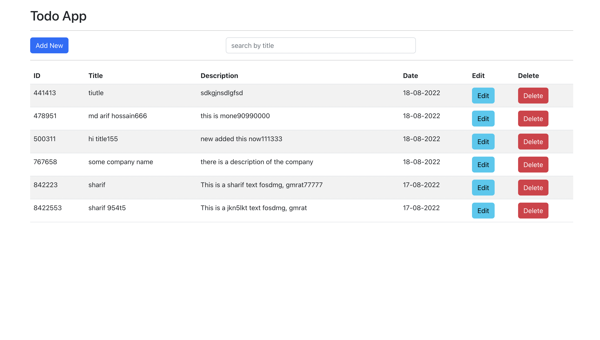

This project has two two part 

`1)Frontend`
`2)Backend`

`The client will run port 3000 and the server will run port 4000`

`To run this app, you can follow one of the two options:--`

## option 1)
First  enter the root directory of the project then make sure that you have installed `concurrently` npm package (globaly or locally), if not then install by `npm i concurrently`

then run the following commands in the terminal. it will install all the `node modules` for server as well as for client.
### `npm run app-install`

Then you can  run the server  and  the client together by the following command:
### `npm run app-start` 

Then you can  run the test  for client  by the following command:
### `npm run app-test` 

## option 2)
you can enter project root directory and then install `node modules` for server by 
### `npm install`

Then you can  run server  by:
### `npm start` 

Then enter client directory and run the following command to install `node modules` for the client
### `npm install`

Then you can  run the client in the client directory:
### `npm start` 

Then you can  run the test for client  in the client directory:
### `npm test` 

Frontend: 
This part done by react js redux redux saga and jest for testing.

`Technologies : node js, express, React, react hooks, redux , redux-saga, and jest`.
---
Please see the `screenshot` to see the view

